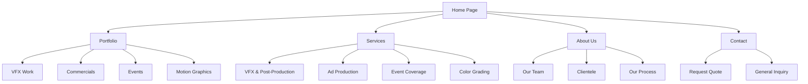

# Hermit Studio Website Architecture

## Overview
A premium, full-operable website for a VFX, Ad, and Event coverage studio targeting elite clients.

## Site Sitemap



## Premium Design System

### Color Palette (Dark Premium Theme)
- **Primary**: #0a0a0a (Deep Black)
- **Secondary**: #1a1a1a (Dark Gray)
- **Accent**: #d4af37 (Gold/Bronze) or #c9a227
- **Text Primary**: #ffffff (White)
- **Text Secondary**: #b0b0b0 (Light Gray)
- **Highlight**: #ff4757 (Subtle Red) or Custom Brand Color

### Typography
- **Headings**: Playfair Display, Cinzel, or Montserrat (Bold)
- **Body**: Lato, Open Sans, or Inter (Light/Regular)
- **Accent**: Space Mono or Roboto Mono (Technical feel)

### Premium UI Elements
1. **Hero Section**: Full-screen video background with overlay
2. **Parallax scrolling effects**
3. **Smooth scroll animations** (AOS or custom)
4. **Glassmorphism** on cards and modals
5. **Minimalist micro-interactions**
6. **Custom cursor** or hover effects
7. **Staggered fade-in animations**
8. **Video lightbox** for portfolio
9. **Magnetic buttons** with hover effects

## Page-by-Page Architecture

### 1. Home Page (`index.html`)
- **Hero Section**: 
  - Full-screen background video (portfolio reel)
  - Animated logo
  - Tagline: "Crafting Visual Excellence"
  - CTA: "View Our Work"
- **Services Preview**: 3-column grid of main services
- **Featured Work**: Carousel of top 3-4 projects
- **Stats/Trust Bar**: Years active, Projects completed, Clients served
- **Client Logos**: Marquee of client brands
- **Testimonial**: Featured client quote
- **CTA Section**: "Ready to create something extraordinary?"
- **Footer**: Contact info, social links, quick navigation

### 2. Portfolio Page (`portfolio.html`)
- **Filter System**: VFX | Commercials | Events | Motion Graphics
- **Grid Layout**: Masonry or responsive grid
- **Hover Effects**: Video preview on hover
- **Lightbox**: Full-screen video viewer
- **Pagination**: Load more or infinite scroll
- **Project Details**: Modal with project info, client, services

### 3. Services Page (`services.html`)
- **Service Cards**: 
  - VFX & Compositing
  - Ad Production (TV/Digital)
  - Event Coverage
  - Color Grading
  - Motion Graphics
  - Drone Services
- **Process Section**: How we work
- **Technology Stack**: Software/tools used (Nuke, Maya, AE, etc.)

### 4. About Page (`about.html`)
- **Our Story**: Company history
- **Team Section**: Team member cards with photos
- **Philosophy**: Our approach to VFX
- **Studio Tour**: Video or gallery of workspace
- **Client List**: Logos of served clients
- **Awards & Recognition**

### 5. Contact Page (`contact.html`)
- **Contact Form**: Name, Email, Project Type, Budget, Message
- **Request Quote Button**: Prominent CTA
- **Contact Info**: Address, Phone, Email
- **Social Media**: Links to all platforms
- **Map**: Google Maps embed
- **FAQ Section**: Common questions

## Technical Stack

### Frontend
- **HTML5**: Semantic structure
- **CSS3**: Custom CSS with CSS Variables
- **JavaScript**: Vanilla JS for performance
- **Libraries**:
  - AOS (Animate On Scroll)
  - Swiper.js (Carousel)
  - GLightbox (Lightbox)
  - Lazy loading for images/videos
  - Smooth scroll (Lenis or native)

### Performance Optimization
- **Lazy loading** for below-fold content
- **Video optimization**: WebM + MP4, poster images
- **Image optimization**: WebP format
- **Minified** CSS/JS in production
- **CDN** for assets (if needed)

### Responsive Design
- **Mobile-first** approach
- **Breakpoints**: 320px, 768px, 1024px, 1440px, 1920px
- **Touch-friendly** navigation
- **Optimized** video playback on mobile

### SEO & Analytics
- **Meta tags**: Title, description, OG tags
- **Schema markup**: Organization, LocalBusiness
- **Sitemap.xml**: For search engines
- **Google Analytics** integration ready
- **Google Search Console** ready

### Accessibility
- **WCAG 2.1** AA compliance
- **Keyboard navigation**
- **Alt text** for all images
- **Aria labels** where needed
- **Color contrast** compliance

## File Structure

```
hermit-studio/
├── index.html
├── portfolio.html
├── services.html
├── about.html
├── contact.html
├── css/
│   ├── main.css
│   ├── components.css
│   ├── responsive.css
│   └── animations.css
├── js/
│   ├── main.js
│   ├── portfolio.js
│   ├── animations.js
│   └── forms.js
├── assets/
│   ├── images/
│   ├── videos/
│   ├── icons/
│   └── fonts/
├── libs/
│   ├── aos.css
│   ├── aos.js
│   ├── swiper.css
│   └── glightbox.css
└── favicon.ico
```

## Premium Features to Include

### Animations & Interactions
1. **Preloader**: Minimalist logo animation
2. **Hero Reveal**: Staggered text animation
3. **Scroll Animations**: Elements fade/slide in on scroll
4. **Parallax**: Background elements move at different speeds
5. **Magnetic Buttons**: Buttons follow cursor slightly
6. **Cursor Effect**: Custom cursor with blending mode
7. **Page Transitions**: Smooth fade between pages
8. **Hover States**: Sophisticated hover effects on cards

### Video & Media
1. **Portfolio Lightbox**: Full-screen video viewer
2. **Background Videos**: Auto-play, muted, looped
3. **Video Hover Previews**: Show preview on portfolio hover
4. **Lazy Loaded Videos**: Load only when visible
5. **Quality Toggle**: 1080p/4k option for videos

### Interactive Elements
1. **Project Filters**: Category-based filtering with animation
2. **Before/After**: For VFX comparison sliders
3. **Client Slider**: Infinite marquee of client logos
4. **Testimonial Cards**: Quote cards with animation
5. **Service Accordion**: Expandable service details
6. **Contact Form**: With validation and success animation

## Budget & Timeline Estimate
- **Questionnaire & Planning**: 1-2 days
- **Design & Wireframes**: 3-5 days
- **Development**: 7-14 days
- **Testing & Polish**: 2-3 days
- **Launch**: 1 day

## Next Steps
1. Complete the questionnaire above
2. Review and approve this architecture plan
3. Provide any specific requirements or changes
4. Begin design phase
